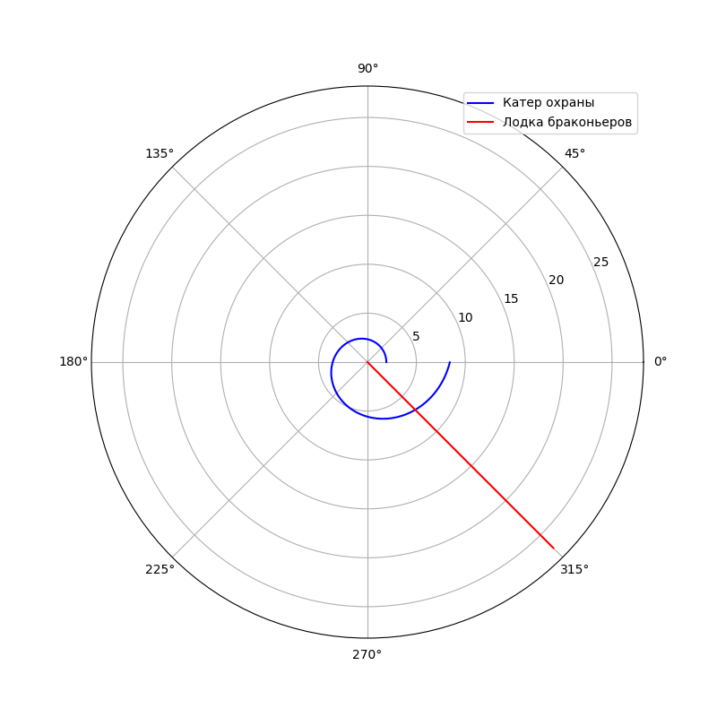
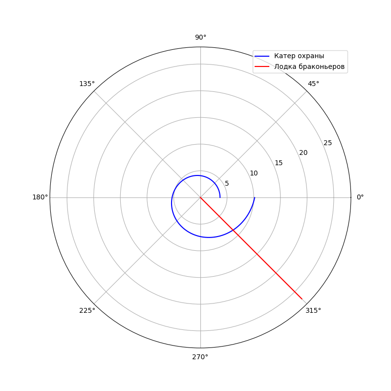

---
## Front matter
lang: ru-RU
title: Задача о погоне
author: |
	 Ласурия Данил НПИбд-01-19\inst{}

institute: |
	\inst{}Российский Университет Дружбы Народов

date: 19 февраля, 2022, Москва, Россия

## Formatting
mainfont: PT Serif
romanfont: PT Serif
sansfont: PT Sans
monofont: PT Mono
toc: false
slide_level: 2
theme: metropolis
header-includes: 
 - \metroset{progressbar=frametitle,sectionpage=progressbar,numbering=fraction}
 - '\makeatletter'
 - '\beamer@ignorenonframefalse'
 - '\makeatother'
aspectratio: 43
section-titles: true

---

## Условие задачи

На море в тумане катер береговой охраны преследует лодку браконьеров.
Через определенный промежуток времени туман рассеивается, и лодка
обнаруживается на расстоянии 8,1 км от катера. Затем лодка снова скрывается в
тумане и уходит прямолинейно в неизвестном направлении. Известно, что скорость
катера в 3,2 раза больше скорости браконьерской лодки

## Теоретический материал
Чтобы найти расстояние ${x}$ (расстояние после которого катер начнет
двигаться вокруг полюса), необходимо составить простое уравнение $\frac{x}{υ}$
$\frac{x+k}{υ}$ или $\frac{x-k}{υ}$
Отсюда мы найдем два значения $x_1$ и $x_2$, задачу будем решать для двух случаев

## Теоретический материал
Решение исходной задачи сводится к решению системы из двух дифференциальных уравнений 

$$
 \begin{cases}
   \frac{dr}{dt}=υ
	\\   
	r\frac{d\theta}{dt}=υ\sqrt{υ^2-1}
 \end{cases}
$$

## Теоретический материал

Исключая из полученной системы производную по $t$, можно перейти к следующему уравнению: $\frac{dr}{d\theta}=\frac{r}{\sqrt{υ^2-1}}$

Начальные условия остаются прежними. Решив это уравнение, мы получим
траекторию движения катера в полярных координатах. 

## Резлуьтат

{ #fig:1 width=45% height=45% }

$$
 \begin{cases}
   \theta=315
   \\
	r=6.9
 \end{cases}
\
$$

## Резлуьтат

{ #fig:2 width=45% height=45% }

$$
 \begin{cases}
   \theta=315
   \\
	r=8.65
 \end{cases}
\
$$

## Итог

Исходя из полученных данных первый вариант погони более выгодный

## Вывод

Рассмотрел задачу о погоне. Провел анализ и вывод дифференциальных уравнений. Смоделировал задачу и проанализировал полученные данные
