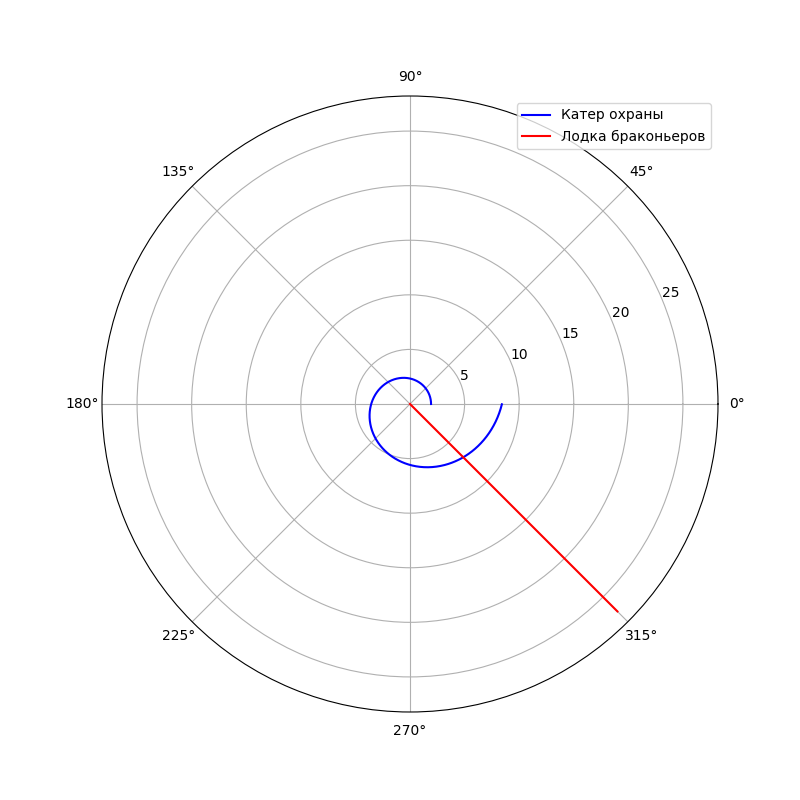

---
# Front matter
lang: ru-RU
title: "Отчет по лабораторной работе №2"
subtitle: "Задача о погоне - вариант 15"
author: "Ласурия Данил Рустанбеевич"

# Formatting
toc-title: "Содержание"
toc: true # Table of contents
toc_depth: 2
lof: true # List of figures
lot: true # List of tables
fontsize: 12pt
linestretch: 1.5
papersize: a4paper
documentclass: scrreprt
polyglossia-lang: russian
polyglossia-otherlangs: english
mainfont: PT Serif
romanfont: PT Serif
sansfont: PT Sans
monofont: PT Mono
mainfontoptions: Ligatures=TeX
romanfontoptions: Ligatures=TeX
sansfontoptions: Ligatures=TeX,Scale=MatchLowercase
monofontoptions: Scale=MatchLowercase
indent: true
pdf-engine: lualatex
header-includes:
  - \linepenalty=10 # the penalty added to the badness of each line within a paragraph (no associated penalty node) Increasing the value makes tex try to have fewer lines in the paragraph.
  - \interlinepenalty=0 # value of the penalty (node) added after each line of a paragraph.
  - \hyphenpenalty=50 # the penalty for line breaking at an automatically inserted hyphen
  - \exhyphenpenalty=50 # the penalty for line breaking at an explicit hyphen
  - \binoppenalty=700 # the penalty for breaking a line at a binary operator
  - \relpenalty=500 # the penalty for breaking a line at a relation
  - \clubpenalty=150 # extra penalty for breaking after first line of a paragraph
  - \widowpenalty=150 # extra penalty for breaking before last line of a paragraph
  - \displaywidowpenalty=50 # extra penalty for breaking before last line before a display math
  - \brokenpenalty=100 # extra penalty for page breaking after a hyphenated line
  - \predisplaypenalty=10000 # penalty for breaking before a display
  - \postdisplaypenalty=0 # penalty for breaking after a display
  - \floatingpenalty = 20000 # penalty for splitting an insertion (can only be split footnote in standard LaTeX)
  - \raggedbottom # or \flushbottom
  - \usepackage{float} # keep figures where there are in the text
  - \floatplacement{figure}{H} # keep figures where there are in the text
---

# Цель работы

Создать математическую модель задачи о погоне

# Описание задачи
На море в тумане катер береговой охраны преследует лодку браконьеров.
Через определенный промежуток времени туман рассеивается, и лодка
обнаруживается на расстоянии 8,1 км от катера. Затем лодка снова скрывается в
тумане и уходит прямолинейно в неизвестном направлении. Известно, что скорость
катера в 3,2 раза больше скорости браконьерской лодки

# Задание
1. Провести необходимые рассуждения и вывод дифференциальных уравнений, если скорость катера больше скорости лодки в n раз.
2. Построить траекторию движения катера и лодки для двух случаев. 
3. Определить по графику точку пересечения катера и лодки.

# Выполнение лабораторной работы
Принимаем за $t_0=0, X_0=0$  - место нахождения лодки браконьеров в момент обнаружения, $X_0=k$   - место нахождения катера береговой охраны относительно лодки браконьеров в момент обнаружения лодки.

Введем полярные координаты. Считаем, что полюс - это точка обнаружения лодки браконьеров $x_0=0 (\theta=x_0=0)$, а полярная ось $r$ проходит через точку нахождения катера береговой охраны.

Чтобы найти расстояние $x$ (расстояние после которого катер начнет двигаться вокруг полюса), необходимо составить простое уравнение. Пусть через время $t$ катер и лодка окажутся на одном расстоянии $x$ от полюса. За это время лодка пройдет $x$, а катер $x-k$ (или $x+k$, в зависимости от начального положения катера относительно полюса). Время, за которое они пройдут это расстояние, вычисляется как $\frac{x}{υ}$ или $\frac{x+k}{υ}$ (для второго случая $\frac{x-k}{υ}$).  Так как время одно и то же, то эти величины одинаковы. Тогда неизвестное расстояние можно найти из следующего уравнения:  $\frac{x}{υ} = \frac{x+k}{υ}$ - в первом случае, $\frac{x}{υ} =  \frac{x-k}{υ}$ во втором случае.

Отсюда мы найдем два значения $x_1$ и $x_2$, задачу будем решать для двух случаев. 

$x_1=\frac{k}{n+1}$ ,при $\theta=0$

$x_2=\frac{k}{n-1}$ ,при $\theta=-\pi$

После того, как катер береговой охраны окажется на одном расстоянии от полюса, что и лодка, он должен сменить прямолинейную траекторию и начать двигаться вокруг полюса удаляясь от него со скоростью лодки $υ$. Для этого скорость катера раскладываем на две составляющие: $υ_r$ - радиальная скорость и $υ_t$- тангенциальная скорость. Радиальная скорость - это скорость, с которой катер удаляется от полюса $υ_r=\frac{dr}{dt}$. Нам нужно, чтобы эта скорость была равна скорости лодки, поэтому полагаем $υ=\frac{dr}{dt}$.
Тангенциальная скорость – это линейная скорость вращения катера относительно полюса. Она равна произведению угловой скорости $\frac{d\theta}{dt}$  на радиус $r$, $υr=r\frac{d\theta}{dt}$
Найдем тангенциальную скорость для нашей задачи $υ_t=r\frac{d\theta}{dt}$.
Вектора образуют прямоугольный треугольник, откуда по теореме Пифагора можно найти тангенциальную скорость $υ_t= \sqrt{n^2 υ_r^2-v^2}$. Поскольку, радиальная скорость равна $υ$, то тангенциальную скорость находим из уравнения $υ_t= \sqrt{n^2 υ^2-υ^2 }$. Следовательно, $υ_τ=υ\sqrt{n^2-1}$.

Тогда получаем $r\frac{d\theta}{dt}=υ\sqrt{n^2-1}$

Решение исходной задачи сводится к решению системы из двух дифференциальных уравнений 

$$
 \begin{cases}
   \frac{dr}{dt}=υ
	\\   
	r\frac{d\theta}{dt}=υ\sqrt{n^2-1}
 \end{cases}
$$

с начальными условиями

$$
 \begin{cases}
   \theta_0=0
   \\
	r_0=\frac{k}{n+1}
 \end{cases}
\
$$

$$
 \begin{cases}
   \theta_0=-\pi
   \\
	r_0=\frac{k}{n-1}
 \end{cases}
\
$$

Исключая из полученной системы производную по $t$, можно перейти к следующему уравнению: $\frac{dr}{d\theta}=\frac{r}{\sqrt{n^2-1}}$

Начальные условия остаются прежними. Решив это уравнение, мы получим
траекторию движения катера в полярных координатах. 
Теперь, когда нам известно все, что нам нужно, построим траекторию движения катера и лодки для двух случаев.

## Код программы
```
  import math
  import numpy as np
  from scipy.integrate import odeint
  import matplotlib.pyplot as plot

  delta = 8.1 # заданное расстояние
  n = 3.2 # разница в скорости
  fi = math.pi * 3/4 # угол движения

  # растояние до движения по полюсу
  r0 = delta/(n+1)
  r1 = delta/(n-1)

  # функция, описывающая движение катера береговой охраны
  def der(tetha, r):
      dr = r / math.sqrt(pow(n,2) -1)
      return dr

  # функция, описывающая движение лодки браконьеров
  def der2(time):
      xt = math.tan(fi) * time
      return xt

  def solver(rs, name):
      print(f"Решение условия {name} r{name} := {round(rs,6)}")
      # решение дифур для катера
      tetha = np.arange(0, 2*math.pi, 0.01)
      r = odeint(der, rs, tetha)
      # движение лоджки
      t=np.arange(0.00000000000001, 20)
      temp_r=np.sqrt(pow(t,2) + pow(der2(t),2))

      tet1=np.arctan(der2(t)/t)

      dot_cross=0
      for i in range(len(tetha)):
          if round(tetha[i], 2) == round(fi+math.pi, 2):
              dot_cross=i  # точка встречи

      plot.rcParams["figure.figsize"] = (8, 8)

      plot.polar(tetha, r, 'blue', label = 'Катер охраны')
      plot.polar(tet1, temp_r, 'red', label = 'Лодка браконьеров')

      plot.legend()
      plot.savefig(f"{name}")
      plot.clf() # сброс plot

      print("Tetha := {} \t R := {} ".format(tetha[dot_cross], float( r[dot_cross])) )
      print("x := {} \t y := {}".format(round(r[dot_cross][0] / math.sqrt(2), 6), round(-r[dot_cross][0] / math.sqrt(2), 6)))

  solver(r0, "1")
  solver(r1, "2")
```


## Резлуьтат
{ #fig:1 }

Точка пересечения синего и красного графиков - точка пересечения катера и лодки, исходя из графика, имеет координаты
$$
 \begin{cases}
   \theta=315
   \\
	r=6.9
 \end{cases}
\
$$

{ #fig:2 }

Точка пересечения синего и красного графиков - точка пересечения катера и лодки, исходя из графика, имеет координаты

$$
 \begin{cases}
   \theta=315
   \\
	r=8.65
 \end{cases}
\
$$

Исходя из полученных данных первый вариант погони более выгодный

# Выводы

Рассмотрел задачу о погоне. Провел анализ и вывод дифференциальных уравнений. Смоделировал задачу и проанализировал полученные данные
